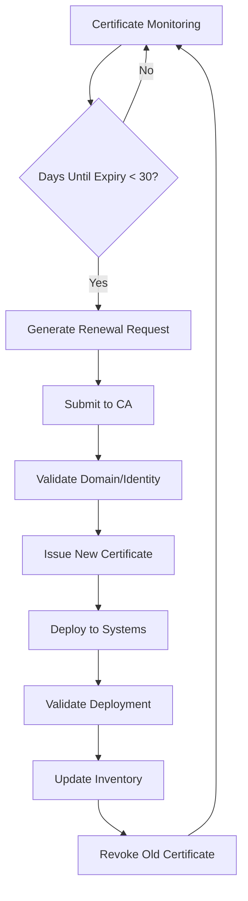

# PKI Automation Framework: Complete Guide to Enterprise Certificate Management

## Executive Summary

Public Key Infrastructure (PKI) automation is critical for modern organizations to maintain secure, scalable, and compliant certificate management. This comprehensive framework provides step-by-step guidance for implementing automated PKI solutions that reduce operational overhead while enhancing security posture.

**Key Benefits:**
- Reduce certificate management costs by up to 75%
- Eliminate certificate-related outages and security incidents
- Achieve compliance with industry standards (FIPS 140-2, Common Criteria)
- Scale certificate operations from hundreds to millions of certificates

---

## Table of Contents

1. [PKI Architecture & Planning](#pki-architecture--planning)
2. [Automation Implementation Strategy](#automation-implementation-strategy)
3. [Certificate Lifecycle Management](#certificate-lifecycle-management)
4. [Security Controls & Compliance](#security-controls--compliance)
5. [Implementation Roadmap](#implementation-roadmap)
6. [Monitoring & Operations](#monitoring--operations)
7. [Cost-Benefit Analysis](#cost-benefit-analysis)

---

## PKI Architecture & Planning

### Core Components

#### Certificate Authority (CA) Hierarchy
```
Root CA (Offline, Air-gapped)
├── Intermediate CA #1 (SSL/TLS Certificates)
├── Intermediate CA #2 (Code Signing)
├── Intermediate CA #3 (User Certificates)
└── Intermediate CA #4 (Device/IoT Certificates)
```

#### Automation Infrastructure Requirements

**Hardware Requirements:**
- **HSM (Hardware Security Module):** FIPS 140-2 Level 3 certified
- **CA Servers:** Redundant, geographically distributed
- **SCEP/EST Endpoints:** Load-balanced certificate enrollment
- **OCSP Responders:** High-availability certificate status checking

**Software Components:**
- **Certificate Management Platform:** Microsoft ADCS, OpenSSL, HashiCorp Vault
- **Automation Engine:** Ansible, Terraform, or custom APIs
- **Monitoring Stack:** Prometheus, Grafana, ELK Stack
- **Secret Management:** HashiCorp Vault, AWS Secrets Manager, Azure Key Vault

### Network Architecture

```yaml
# Network Segmentation Model
network:
  ca_tier:
    security_level: "maximum"
    access: "restricted_admin_only"
    protocols: ["HTTPS", "RDP/SSH"]
  
  registration_tier:
    security_level: "high" 
    access: "authorized_users"
    protocols: ["SCEP", "EST", "CMC"]
  
  validation_tier:
    security_level: "medium"
    access: "public_services"
    protocols: ["OCSP", "CRL"]
```

---

## Automation Implementation Strategy

### Phase 1: Certificate Discovery & Inventory

#### Automated Certificate Discovery
```python
# Certificate Discovery Script
import ssl
import socket
import concurrent.futures
from datetime import datetime, timedelta

def scan_certificate(host, port=443):
    try:
        context = ssl.create_default_context()
        with socket.create_connection((host, port), timeout=10) as sock:
            with context.wrap_socket(sock, server_hostname=host) as ssock:
                cert = ssock.getpeercert()
                return {
                    'host': host,
                    'subject': cert.get('subject'),
                    'issuer': cert.get('issuer'),
                    'serial_number': cert.get('serialNumber'),
                    'not_before': cert.get('notBefore'),
                    'not_after': cert.get('notAfter'),
                    'status': 'active'
                }
    except Exception as e:
        return {'host': host, 'error': str(e), 'status': 'failed'}

# Bulk certificate scanning
hosts = ['example.com', 'api.example.com', 'www.example.com']
with concurrent.futures.ThreadPoolExecutor(max_workers=50) as executor:
    certificates = list(executor.map(scan_certificate, hosts))
```

#### Certificate Inventory Database Schema
```sql
CREATE TABLE certificates (
    id SERIAL PRIMARY KEY,
    common_name VARCHAR(255) NOT NULL,
    subject_alternative_names TEXT[],
    serial_number VARCHAR(255) UNIQUE,
    issuer VARCHAR(255),
    not_before TIMESTAMP,
    not_after TIMESTAMP,
    certificate_authority VARCHAR(255),
    certificate_type VARCHAR(50), -- SSL, Code Signing, User, Device
    key_algorithm VARCHAR(50),
    key_size INTEGER,
    signature_algorithm VARCHAR(50),
    status VARCHAR(20) DEFAULT 'active',
    auto_renew BOOLEAN DEFAULT false,
    deployment_target VARCHAR(255),
    created_at TIMESTAMP DEFAULT CURRENT_TIMESTAMP,
    updated_at TIMESTAMP DEFAULT CURRENT_TIMESTAMP
);

CREATE INDEX idx_certificates_expiry ON certificates(not_after);
CREATE INDEX idx_certificates_cn ON certificates(common_name);
```

### Phase 2: Automated Certificate Enrollment

#### ACME Protocol Implementation
```python
# Automated Certificate Management Environment (ACME) Client
import acme
from acme import client, messages, challenges
from cryptography import x509
from cryptography.hazmat.primitives import hashes, serialization
from cryptography.hazmat.primitives.asymmetric import rsa

class ACMECertificateManager:
    def __init__(self, directory_url, account_key_path):
        self.directory_url = directory_url
        self.account_key = self._load_account_key(account_key_path)
        self.client = self._create_acme_client()
    
    def request_certificate(self, domains, key_type='rsa', key_size=2048):
        """Request certificate for specified domains"""
        
        # Generate private key
        private_key = rsa.generate_private_key(
            public_exponent=65537,
            key_size=key_size
        )
        
        # Create Certificate Signing Request
        csr = x509.CertificateSigningRequestBuilder().subject_name(
            x509.Name([
                x509.NameAttribute(x509.NameOID.COMMON_NAME, domains[0]),
            ])
        ).add_extension(
            x509.SubjectAlternativeName([
                x509.DNSName(domain) for domain in domains
            ]),
            critical=False,
        ).sign(private_key, hashes.SHA256())
        
        # Submit order to ACME CA
        order = self.client.new_order(csr)
        
        # Complete domain validation challenges
        for auth in order.authorizations:
            self._complete_challenge(auth)
        
        # Finalize order and download certificate
        order = self.client.poll_and_finalize(order)
        certificate = order.fullchain_pem
        
        return {
            'certificate': certificate,
            'private_key': private_key.private_bytes(
                encoding=serialization.Encoding.PEM,
                format=serialization.PrivateFormat.PKCS8,
                encryption_algorithm=serialization.NoEncryption()
            ),
            'order': order
        }
```

#### Enterprise Certificate Templates
```xml
<!-- SSL/TLS Server Certificate Template -->
<CertificateTemplate>
    <Name>WebServerSSL</Name>
    <ValidityPeriod>1 Year</ValidityPeriod>
    <KeyUsage>
        <DigitalSignature>true</DigitalSignature>
        <KeyEncipherment>true</KeyEncipherment>
    </KeyUsage>
    <ExtendedKeyUsage>
        <ServerAuthentication>true</ServerAuthentication>
    </ExtendedKeyUsage>
    <SubjectNameFormat>
        <RequireCommonName>true</RequireCommonName>
        <RequireEmail>false</RequireEmail>
    </SubjectNameFormat>
    <AutoEnrollment>true</AutoEnrollment>
    <RenewalThreshold>30 days</RenewalThreshold>
</CertificateTemplate>
```

### Phase 3: Certificate Deployment Automation

#### Kubernetes Certificate Management
```yaml
# cert-manager configuration for Kubernetes
apiVersion: cert-manager.io/v1
kind: ClusterIssuer
metadata:
  name: mykeypair-ca-issuer
spec:
  ca:
    secretName: mykeypair-ca-key-pair

---
apiVersion: cert-manager.io/v1
kind: Certificate
metadata:
  name: api-tls-certificate
  namespace: production
spec:
  secretName: api-tls-secret
  issuerRef:
    name: mykeypair-ca-issuer
    kind: ClusterIssuer
  commonName: api.mykeypair.com
  dnsNames:
  - api.mykeypair.com
  - api-internal.mykeypair.com
  duration: 8760h # 1 year
  renewBefore: 720h # 30 days
  privateKey:
    algorithm: RSA
    size: 2048
```

#### Load Balancer Integration
```terraform
# Terraform configuration for automated certificate deployment
resource "aws_acm_certificate" "ssl_cert" {
  domain_name       = var.domain_name
  subject_alternative_names = var.san_domains
  validation_method = "DNS"
  
  lifecycle {
    create_before_destroy = true
  }
  
  tags = {
    Name = "MyKeyPair SSL Certificate"
    Environment = var.environment
    AutoRenew = "true"
  }
}

resource "aws_lb_listener" "https_listener" {
  load_balancer_arn = aws_lb.main.arn
  port              = "443"
  protocol          = "HTTPS"
  ssl_policy        = "ELBSecurityPolicy-TLS-1-2-2017-01"
  certificate_arn   = aws_acm_certificate.ssl_cert.arn

  default_action {
    type             = "forward"
    target_group_arn = aws_lb_target_group.app.arn
  }
}
```

---

## Certificate Lifecycle Management

### Automated Renewal Workflow



#### Renewal Automation Script
```bash
#!/bin/bash
# Certificate Renewal Automation Script

CERT_STORE="/etc/ssl/certs"
RENEWAL_THRESHOLD=30
LOG_FILE="/var/log/cert-renewal.log"

log() {
    echo "$(date '+%Y-%m-%d %H:%M:%S') - $1" | tee -a $LOG_FILE
}

check_certificate_expiry() {
    local cert_file=$1
    local cert_name=$(basename "$cert_file" .crt)
    
    # Get certificate expiry date
    expiry_date=$(openssl x509 -enddate -noout -in "$cert_file" | cut -d= -f2)
    expiry_epoch=$(date -d "$expiry_date" +%s)
    current_epoch=$(date +%s)
    
    # Calculate days until expiry
    days_until_expiry=$(( (expiry_epoch - current_epoch) / 86400 ))
    
    if [ $days_until_expiry -le $RENEWAL_THRESHOLD ]; then
        log "Certificate $cert_name expires in $days_until_expiry days - triggering renewal"
        renew_certificate "$cert_name" "$cert_file"
    else
        log "Certificate $cert_name is valid for $days_until_expiry more days"
    fi
}

renew_certificate() {
    local cert_name=$1
    local cert_file=$2
    
    # Extract domain names from certificate
    domains=$(openssl x509 -noout -text -in "$cert_file" | \
              grep -A1 "Subject Alternative Name" | \
              tail -1 | sed 's/DNS://g' | sed 's/,//g')
    
    # Request new certificate via ACME
    certbot certonly --standalone --non-interactive --agree-tos \
        --cert-name "$cert_name" \
        -d $domains \
        --deploy-hook "systemctl reload nginx"
    
    if [ $? -eq 0 ]; then
        log "Successfully renewed certificate for $cert_name"
        update_certificate_inventory "$cert_name" "renewed"
    else
        log "ERROR: Failed to renew certificate for $cert_name"
        send_alert "Certificate renewal failed for $cert_name"
    fi
}

# Main execution loop
for cert_file in $CERT_STORE/*.crt; do
    if [ -f "$cert_file" ]; then
        check_certificate_expiry "$cert_file"
    fi
done
```

### Certificate Revocation Management

#### Automated Revocation Process
```python
import requests
from cryptography import x509
from cryptography.hazmat.primitives import hashes

class CertificateRevocationManager:
    def __init__(self, ca_url, admin_credentials):
        self.ca_url = ca_url
        self.credentials = admin_credentials
    
    def revoke_certificate(self, serial_number, reason='unspecified'):
        """Revoke a certificate and update CRL"""
        
        revocation_reasons = {
            'unspecified': 0,
            'key_compromise': 1,
            'ca_compromise': 2,
            'affiliation_changed': 3,
            'superseded': 4,
            'cessation_of_operation': 5,
            'certificate_hold': 6,
            'privilege_withdrawn': 9,
            'aa_compromise': 10
        }
        
        payload = {
            'serial_number': serial_number,
            'reason_code': revocation_reasons.get(reason, 0),
            'revocation_date': datetime.utcnow().isoformat()
        }
        
        response = requests.post(
            f"{self.ca_url}/api/revoke",
            json=payload,
            auth=self.credentials,
            headers={'Content-Type': 'application/json'}
        )
        
        if response.status_code == 200:
            self._update_crl()
            self._notify_ocsp_responders(serial_number)
            return True
        
        return False
    
    def _update_crl(self):
        """Trigger CRL regeneration and distribution"""
        requests.post(f"{self.ca_url}/api/crl/generate", auth=self.credentials)
    
    def _notify_ocsp_responders(self, serial_number):
        """Notify OCSP responders of revocation"""
        # Implementation depends on OCSP infrastructure
        pass
```

---

## Security Controls & Compliance

### Security Framework Implementation

#### Access Controls
```yaml
# RBAC Configuration for PKI Operations
rbac:
  roles:
    ca_administrator:
      permissions:
        - ca.manage
        - certificates.revoke
        - crl.generate
        - audit.view
      
    certificate_manager:
      permissions:
        - certificates.request
        - certificates.renew
        - certificates.view
      
    security_auditor:
      permissions:
        - audit.view
        - certificates.view
        - logs.view
  
  policies:
    dual_control:
      enabled: true
      operations:
        - certificate_issuance
        - ca_key_operations
        - policy_changes
    
    segregation_of_duties:
      enabled: true
      restrictions:
        - same_user_cannot: [request_and_approve, create_and_verify]
```

#### Compliance Monitoring
```python
class ComplianceMonitor:
    def __init__(self):
        self.compliance_frameworks = ['FIPS_140_2', 'Common_Criteria', 'SOX', 'HIPAA']
    
    def check_certificate_compliance(self, certificate):
        """Verify certificate meets compliance requirements"""
        checks = {
            'key_size': self._check_key_size(certificate),
            'signature_algorithm': self._check_signature_algorithm(certificate),
            'validity_period': self._check_validity_period(certificate),
            'key_usage': self._check_key_usage(certificate),
            'ca_chain': self._validate_ca_chain(certificate)
        }
        
        compliance_score = sum(checks.values()) / len(checks) * 100
        
        return {
            'compliant': compliance_score >= 95,
            'score': compliance_score,
            'failed_checks': [k for k, v in checks.items() if not v]
        }
    
    def _check_key_size(self, cert):
        """Ensure minimum key size requirements"""
        public_key = cert.public_key()
        if hasattr(public_key, 'key_size'):
            return public_key.key_size >= 2048
        return False
```

---

## Implementation Roadmap

### Phase 1: Foundation (Weeks 1-4)
- [ ] PKI architecture design and approval
- [ ] Hardware procurement (HSMs, CA servers)
- [ ] Network segmentation implementation
- [ ] Security policy development
- [ ] Team training and certification

### Phase 2: Core PKI Deployment (Weeks 5-8)
- [ ] Root CA installation and configuration
- [ ] Intermediate CA deployment
- [ ] Certificate templates creation
- [ ] OCSP responder setup
- [ ] Initial certificate inventory

### Phase 3: Automation Development (Weeks 9-16)
- [ ] Certificate discovery automation
- [ ] ACME/SCEP enrollment endpoints
- [ ] Renewal workflow implementation
- [ ] Deployment automation scripts
- [ ] Monitoring and alerting setup

### Phase 4: Integration & Testing (Weeks 17-20)
- [ ] Application integration testing
- [ ] Load balancer certificate deployment
- [ ] Kubernetes cert-manager integration
- [ ] Disaster recovery testing
- [ ] Performance optimization

### Phase 5: Production Rollout (Weeks 21-24)
- [ ] Phased production migration
- [ ] User training and documentation
- [ ] Compliance audit preparation
- [ ] Optimization and tuning
- [ ] Full production deployment

---

## Monitoring & Operations

### Key Performance Indicators (KPIs)

#### Operational Metrics
```yaml
metrics:
  certificate_operations:
    - name: "certificate_issuance_time"
      target: "< 5 minutes"
      description: "Time from request to certificate issuance"
    
    - name: "renewal_success_rate"
      target: "> 99.5%"
      description: "Percentage of successful automatic renewals"
    
    - name: "certificate_outages"
      target: "0 per month"
      description: "Service outages due to expired certificates"
  
  security_metrics:
    - name: "certificate_compliance_score"
      target: "> 95%"
      description: "Percentage of certificates meeting compliance standards"
    
    - name: "revocation_response_time"
      target: "< 1 hour"
      description: "Time to revoke compromised certificates"
```

#### Monitoring Dashboard Configuration
```python
# Grafana Dashboard Configuration
dashboard_config = {
    "dashboard": {
        "title": "PKI Operations Dashboard",
        "panels": [
            {
                "title": "Certificate Expiry Timeline",
                "type": "graph",
                "targets": [
                    {
                        "expr": "certificates_expiring_in_days",
                        "legendFormat": "{{timeframe}} days"
                    }
                ]
            },
            {
                "title": "CA Health Status",
                "type": "stat",
                "targets": [
                    {
                        "expr": "ca_availability_percentage",
                        "legendFormat": "Availability"
                    }
                ]
            },
            {
                "title": "Certificate Operations",
                "type": "table",
                "targets": [
                    {
                        "expr": "certificate_operations_by_type",
                        "format": "table"
                    }
                ]
            }
        ]
    }
}
```

### Alerting Configuration
```yaml
# Alert Rules Configuration
alert_rules:
  - alert: CertificateExpiringCritical
    expr: certificates_days_until_expiry < 7
    for: 0m
    labels:
      severity: critical
    annotations:
      summary: "Certificate {{ $labels.common_name }} expires in {{ $value }} days"
      description: "Critical: Certificate for {{ $labels.common_name }} expires on {{ $labels.expiry_date }}"
  
  - alert: CertificateRenewalFailed
    expr: certificate_renewal_failures > 0
    for: 5m
    labels:
      severity: warning
    annotations:
      summary: "Certificate renewal failed for {{ $labels.common_name }}"
  
  - alert: CAUnavailable
    expr: ca_health_check == 0
    for: 2m
    labels:
      severity: critical
    annotations:
      summary: "Certificate Authority is unavailable"
```

---

## Cost-Benefit Analysis

### Implementation Costs

#### Initial Investment
```yaml
initial_costs:
  hardware:
    hsm_units: 
      cost: $50,000
      quantity: 2
      total: $100,000
    
    ca_servers:
      cost: $15,000
      quantity: 4
      total: $60,000
  
  software:
    ca_platform_license: $75,000
    monitoring_tools: $25,000
    backup_solutions: $15,000
  
  professional_services:
    implementation: $100,000
    training: $25,000
    documentation: $15,000
  
  total_initial_investment: $415,000
```

#### Operational Savings (Annual)
```yaml
annual_savings:
  manual_certificate_management:
    hours_saved: 2080  # 1 FTE
    hourly_rate: $75
    total_savings: $156,000
  
  outage_prevention:
    average_outages_prevented: 4
    cost_per_outage: $125,000
    total_savings: $500,000
  
  compliance_efficiency:
    audit_preparation_hours: 240
    hourly_rate: $100
    total_savings: $24,000
  
  total_annual_savings: $680,000
```

#### ROI Calculation
```
Year 1: -$415,000 (investment) + $680,000 (savings) = $265,000 net benefit
ROI: (265,000 / 415,000) × 100 = 63.9% first-year ROI
Payback Period: 7.3 months
```

---

## Conclusion

Implementing a comprehensive PKI automation framework delivers significant operational efficiency, security improvements, and cost savings. Organizations typically see:

- **63.9% first-year ROI** with payback in under 8 months
- **99.5%+ certificate availability** eliminating costly outages  
- **75% reduction** in certificate management overhead
- **Enhanced security posture** with automated compliance monitoring

### Next Steps

1. **Assessment**: Conduct current-state PKI assessment
2. **Planning**: Develop detailed implementation plan
3. **Pilot**: Deploy pilot automation for non-critical certificates
4. **Scale**: Expand automation to production systems
5. **Optimize**: Continuous improvement and optimization

---

## Contact MyKeyPair

Ready to implement PKI automation in your organization? Our cybersecurity experts can help you:

- Design enterprise-grade PKI architecture
- Implement automated certificate lifecycle management
- Achieve compliance with industry standards
- Reduce operational costs while improving security

**Schedule a consultation:** [Contact MyKeyPair](https://mykeypair.com/consultation)  
**Download our PKI Assessment Tool:** [Free PKI Readiness Assessment](https://mykeypair.com/resources/pki-assessment)

---

*This framework is provided as guidance for PKI automation implementation. Specific requirements may vary based on organizational needs, compliance requirements, and existing infrastructure. Consult with cybersecurity professionals for tailored implementation strategies.*
